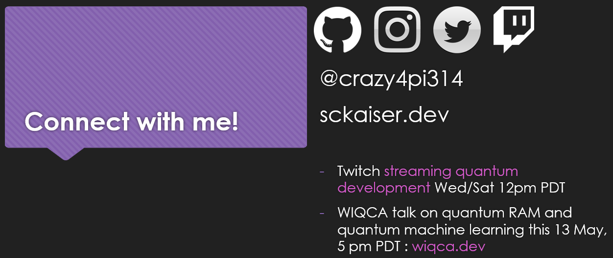

# Azure Community Live # 16
## Dr Sarah Kaiser / Get started developing for Quantum computers today

This is the repo for my slides and demo code for episode #16 on [Azure Community Live](https://azure-community.live/).

- Run all of the code online with no install on [mybinder.org](https://mybinder.org/v2/gh/crazy4pi314/azure-community-live/master)

- Recording of talk can be found here: [YouTube](https://www.youtube.com/watch?v=NdROr0zyMrI)

----
## Get started with quantum development

If you are interested in learning more about developing for a quantum computer, check out these links.

- [Q# and Quantum Development Kit docs](http://docs.microsoft.com/quantum/)
- [Main GitHub project for the QDK](https://www.github.com/microsoft/quantum)
- [Q# community/user group](https://www.qsharp.community)
- [WIQCA (Women in Quantum Computing and Applications)](https://www.wiqca.dev)
- [My book: Learn Quantum Computing with Python and Q#](bit.ly/qharp-book)

----
## Connect with me!

- [Twitch](https://twitch.tv/crazy4pi314/)
- [GitHub](https://github.com/crazy4pi314/)
- [Twitter](https://twitter.com/crazy4pi314/)
- [sckaiser.dev](https://www.sckaiser.dev)